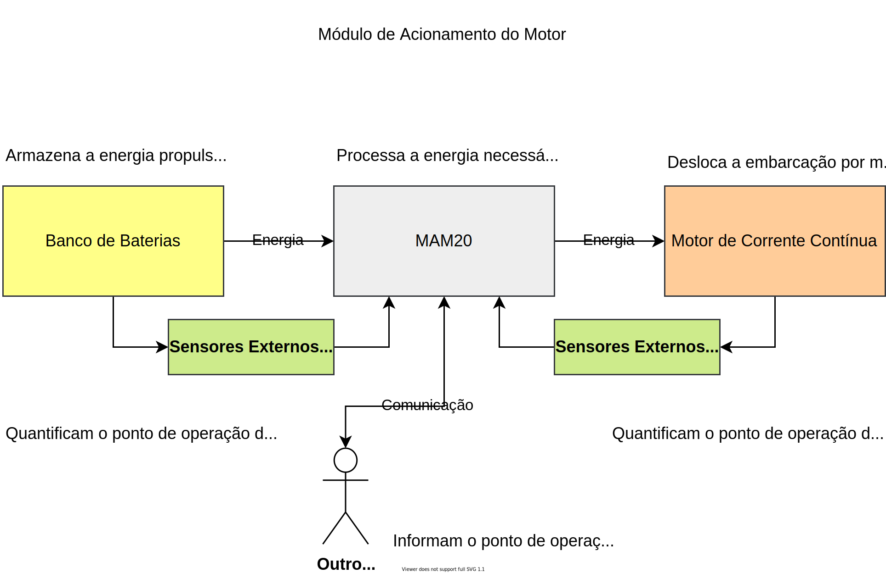

# MAM20
**M**ódulo de **A**cionamento do **M**otor 2020

Embarcação Guarapuvu II

Equipe Zênite solar

### Sobre
Este módulo é responsável por realizar o acionamento de um motor de imã permanente, controlando sua velocidade e sentido de rotação.

### Requisitos de projeto

1. **Acionamento do motor**

   - Permitir o acionamento nos dois sentidos

   - Permitir o controle em malha fechada

     - Corrente/Torque

     - Tensão/RPM

       

2. **Proteções**

   - Sobre-temperatura do motor

   - Sobre-temperatura do acionamento

   - Sobre-tensão de entrada

   - Sobre-corrente de saída

   - Falha de comunicação

   - Desconexão dos mosfets de potênica

     - Garantir que os mosfets permaneçam desligados se a placa de controle for removida

   - Lógica para início de funcionamento

     - O motor só pode ser acionado se o procedimento de início for seguido na sequência correta

       - Dead man`s switch conectado

       - Sistema elétrico ativado

       - Potenciômetro em zero

       - Chave do motor ligada

         

3. **Interfaces**

   - Ser controlado pela rede CANBUS implementada na embarcação

   - Sinalização por meio de LEDs

   - Permitir debug pela serial

     

### Abordagens

Especificações do conversor

| Tensão de Entrada | 20 ~ 60 V |
| ----------------: | :-------- |
|   Tensão de Saída | 0 ~ 48V   |
| Corrente de Saída | 150 A     |
|        Eficiência | > 80%     |

